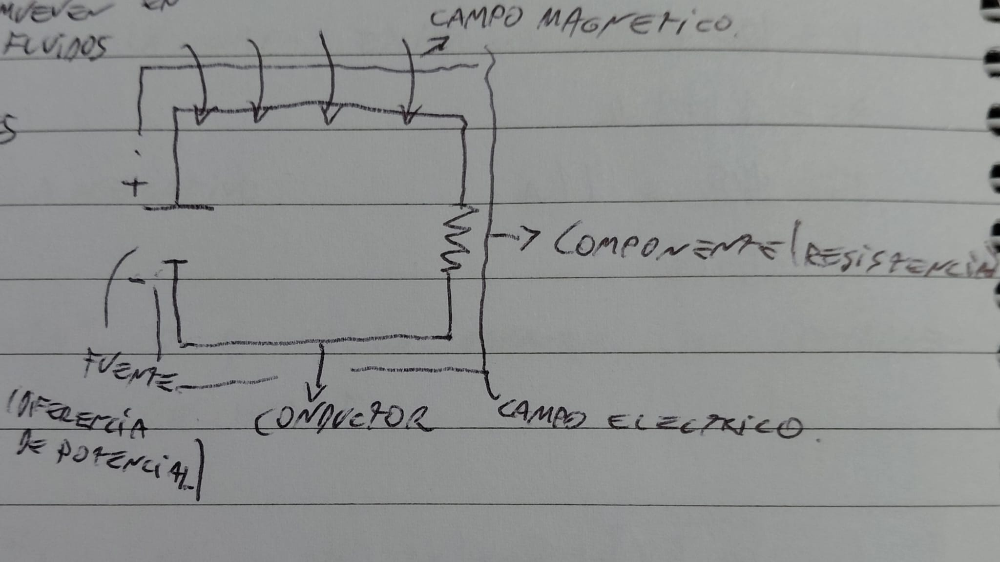
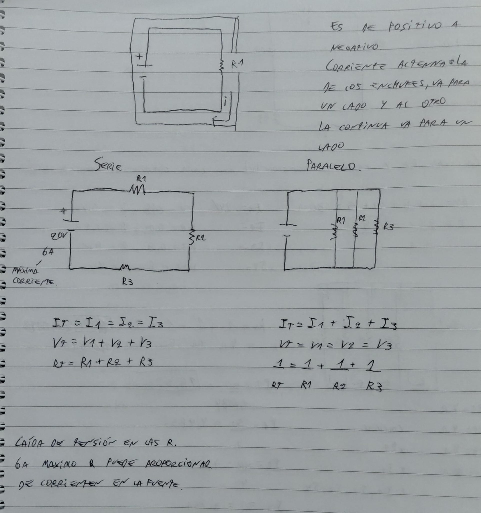
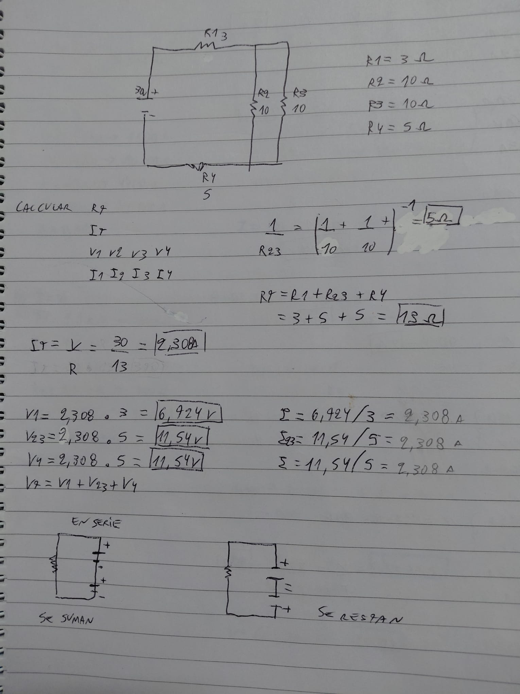
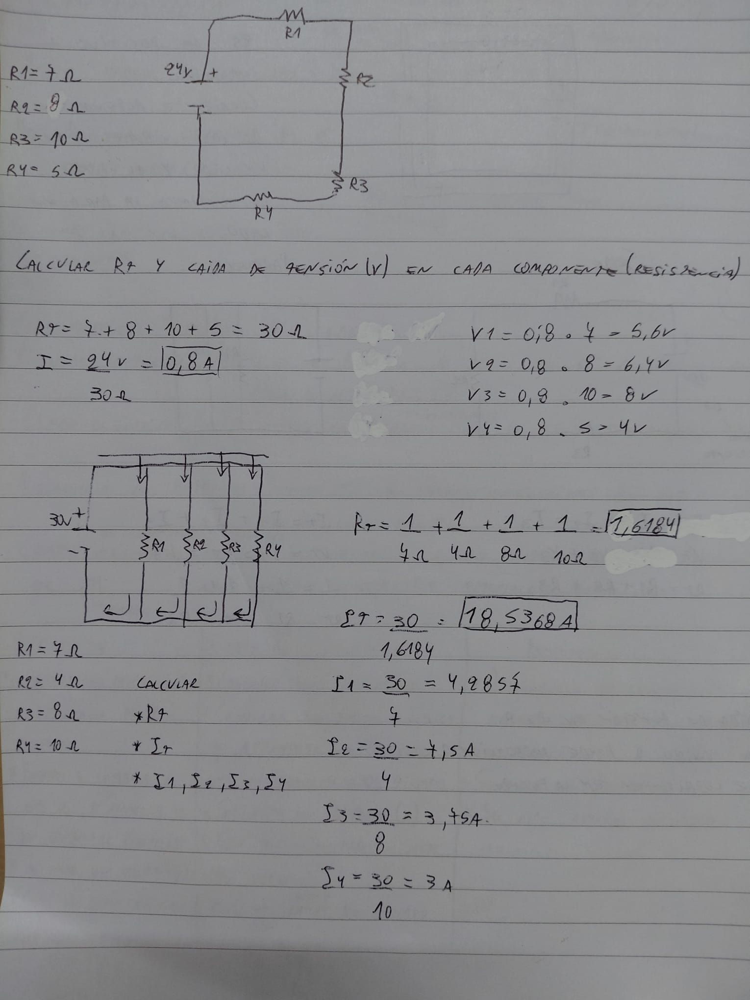

# Semana 2: Fundamentos de STEAM

# Electricidad:

**DEF: Movimiento ordenado de e⁻ en un conductor electrico.**

Puede haber electricidad por iones(se mueven en fluidos).
Los e⁻ se mueven en metales.

El campo electrico esta en todo el circuito.

### Esquema del Circuitos Electricos

---

---

---

---

**Campo magnetico va alrededor del cable**
* **Material conductor:** Material que permite el paso de e⁻ a traves de el con relativa facilidad.

* **Campo electrico:** Región donde las cargas electricas(e⁻) experimentan una fuerza.

* **Diferencia de potencial:** Separación de cargas eléctricas en los terminales de una fuente.

* **Campo magnetico:** Region del espacio donde actuan fuerzas magneticas sobre cargas eléctricas o materiales metalicos (Es acumulativo [las bobinas]).

| VOLTAJE | CORRIENTE ELECTRICA | RESISTENCIA |
| :--- | :--- | :--- |
| * Conocido como "Tensión" o diferencia de potencial. | * Conocido como intensidad. | * Oposición que presenta un material al pasaje de corriente electrica. |
| * Fuerza que impulsa a los e⁻ a moverse en un conductor electrico. | * Cantidad de carga electrica que atraviesa un conductor en un determinado tiempo. | * Se mide en ohms (Ω). |
| * Se mide en volts (V). | * Se mide en amperes (A). | * Se mide aislada del circuito electrico. |
| * Con voltimetro se mide en paralelo. | * Con amperimetro se mide en serie. En un lapso de tiempo. | |
