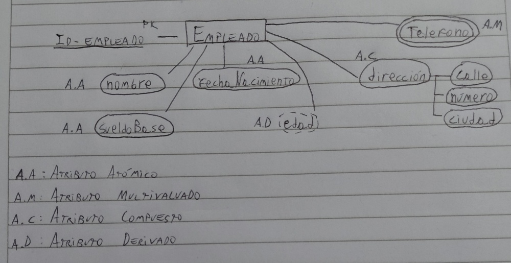

# Semana 3: Modelo Entidad-Relación - Atributos y Componentes

Un atributo es una característica de una entidad (por ejemplo, el nombre de una persona o el precio de un producto).

## 1. Tipos de Atributos

### Atributo Atómico (Simple)
Es un componente que **no se puede dividir** en partes más pequeñas con significado propio.
* **Ejemplo:** La Cédula de Identidad ($CI$) o el Nombre.
* **Representación:** Se escribe generalmente en minúscula y debe estar encerrado en una **elipse** (óvalo) simple conectada a la entidad.

### Atributo Compuesto
Es aquel que tiene varias partes y se precisa de sus "sub-atributos" para estar completo.
* **Ejemplo:** **Dirección**. Para que sea útil, se desglosa en:
    * Calle
    * Número de puerta
    * Localidad/Barrio
* **Representación:** Tanto el atributo principal como cada uno de sus hijos deben tener su **propia elipse individual**. Del óvalo principal salen líneas rectas que se ramifican hacia los óvalos de los sub-atributos.

> ⚠️ **Nota sobre el Asterisco (*):** Se utiliza para indicar que un atributo es **obligatorio** (Not Null). Si la Dirección tiene un asterisco, significa que el sistema no permitirá guardar el registro si ese campo está vacío.

---

## 2. Atributos según su Cardinalidad

### Atributo Multivaluado
Es un atributo que puede tener **más de un valor** para una misma entidad. Son opcionales en el sentido de que no siempre hay una cantidad fija.
* **Ejemplo:** **Teléfono**. Un empleado puede tener un celular personal, uno de trabajo y un fijo.
* **Representación:** En los diagramas se representa con una **doble elipse** (un círculo dentro de otro).

---

## 3. Atributos Derivados
Son aquellos que **nacen a partir del cálculo de otro atributo** que ya existe en la base de datos. No se almacenan físicamente para ahorrar espacio.
* **Ejemplos:**
    * **Edad:** Se deriva de la *Fecha de Nacimiento*.
    * **Sueldo Neto:** Se deriva de $(Horas\ de\ trabajo \times Valor\ hora) - Descuentos$.
* **Representación:** Se dibuja con una **elipse de línea punteada** o discontinua.

---

## 4. Conceptos de Modificación
* **Registro:** Se refiere al acto de hacer una modificación en la Base de Datos (insertar, actualizar o borrar datos).

## 5. Ejemplo de Estructura: Departamentos
Las entidades pueden agruparse o clasificarse. Por ejemplo, una empresa tiene diferentes departamentos:
* RR.HH.
* TI (Tecnología de la Información)
* Marketing.

---

## 💡 Información Extra 
* **Atributo Clave (Key):** Es el atributo que identifica de forma única a cada entidad (como tu $CI$). En el diagrama, el nombre del atributo debe ir dentro de una elipse y **subrayado**.
* **Atributos Nulos (Null):** A veces un atributo puede no tener valor (ej. no tener teléfono fijo). Es vital definir si un campo permite nulos o es obligatorio.
* **¿Por qué usar Atributos Derivados?** Evitan datos redundantes. Al guardar la fecha de nacimiento, la edad se calcula automáticamente y siempre está actualizada.

---

## 📸 Ejemplo Práctico: Entidad Empleado
En este diagrama se puede observar la aplicación real de todos los conceptos anteriores: el atributo clave (PK) subrayado, los compuestos ramificados, los multivaluados con doble elipse y el derivado punteado.

---