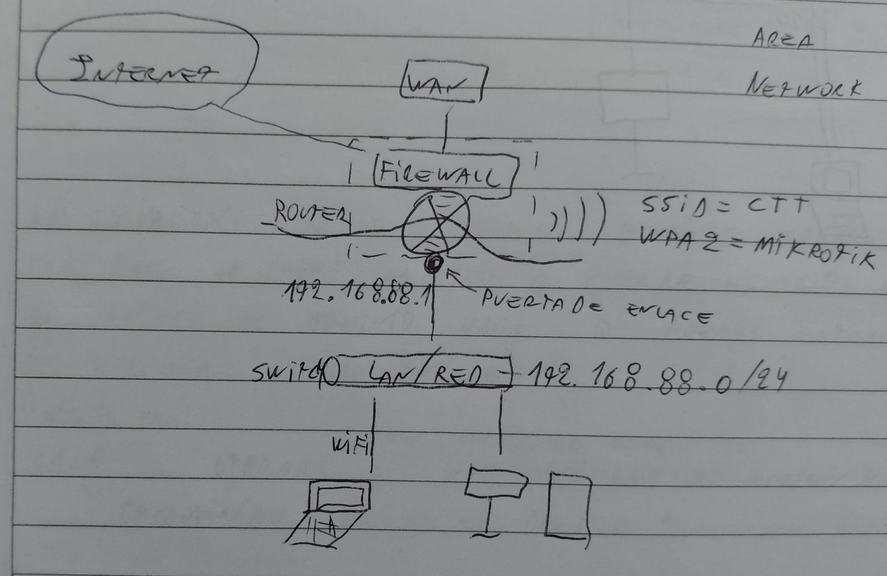
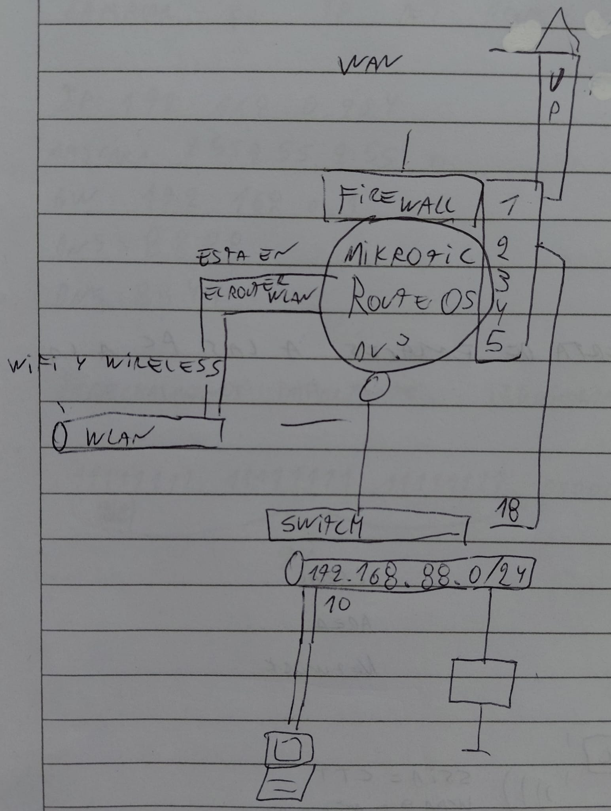

# Configuración y Administración de MikroTik (RouterOS)

## Conceptos Fundamentales
* **Filosofía Técnica:** Un buen técnico debe **documentar todo**. La infraestructura que no se documenta es invisible y difícil de reparar.
* **Identificación de Dispositivos:** Cada equipo en la red debe ser identificado por:
    * **Hostname:** Nombre lógico del equipo (ej: `Router-Principal`).
    * **Dirección MAC:** Dirección física única de la placa de red.
    * **IP / GW:** Su ubicación lógica y su puerta de salida.

## Arquitectura de Red con MikroTik
El MikroTik actúa como el núcleo de la red, gestionando la seguridad y el ruteo.

> **Nota:** Esquema general de la red.
---

### Componentes del Diagrama
1.  **WAN (Wide Area Network):** El enlace que viene del ISP (proveedor de internet). 
    * En tus notas, el puerto **1** se utiliza para la WAN.
    * Ejemplo de IP WAN: `192.168.19.225` con Gateway `192.168.5.254`.
2.  **Firewall:** Capa de seguridad integrada en RouterOS que filtra el tráfico entrante y saliente. El MikroTik hace de **Puerta de Enlace (Gateway)** para que las PCs accedan a Internet.
3.  **LAN (Local Area Network):** Tu red interna.
    * Segmento de red (Profe): `192.168.88.0/24`.
    * IP del Router en la LAN: `192.168.88.1`.
4.  **WLAN / Wi-Fi:**
    * **SSID:** `CTT` (El nombre que ven los dispositivos).
    * **Seguridad:** `WPA2` (Protocolo de cifrado).
    * **Password:** `mikrotik`.

---

## Conectividad Física (Puertos y Cableado)
Es vital identificar dónde conectamos cada cable para evitar bucles o fallas de ruteo:

| Puerto | Destino | Tipo de Red |
| :--- | :--- | :--- |
| **Puerto 1** | Módem / Fibra (Enlace Up) | **WAN** |
| **Puerto 2** | Conexión a Switch local | **LAN** |
| **Puertos 3-5** | Disponibles para otros servicios | LAN / DMZ |

> **Nota:** Mapeo de puertos físicos del MikroTik hacia la pachera (puerto 23) y el switch (puerto 18).
---

* **Switch:** Se conecta habitualmente al Puerto 2 del MikroTik para expandir la cantidad de bocas disponibles para PCs y otros dispositivos finales. Según tus notas, el cable que sale del puerto 2 del MikroTik llega al puerto **18** del Switch.

---

## Herramientas y Diagnóstico en RouterOS
* **Microtip:** Los equipos MikroTik (como el hAP lite) suelen tener poca memoria RAM (ej: 32MB o 64MB), por lo que es importante no sobrecargarlos con reglas de firewall innecesarias.
* **Tablas ARP y Bridge:** Para ver qué dispositivos están conectados físicamente.
* **Winbox:** La herramienta principal (interfaz gráfica) para gestionar MikroTik.
* **Documentación de Puertos:** * El Puerto 1 del MikroTik (Internet) fue conectado al puerto **23** de la pachera/WAN.
    * El Puerto 2 del MikroTik (Red Local) fue conectado al puerto **18** del switch.

---

## Resumen de Direccionamiento de tus Notas
* **Red LAN:** `192.168.88.0`
* **Máscara:** `/24` (255.255.255.0)
* **Gateway Local:** `192.168.88.1`
* **DNS Recomendados:** `8.8.8.8` / `1.1.1.1`