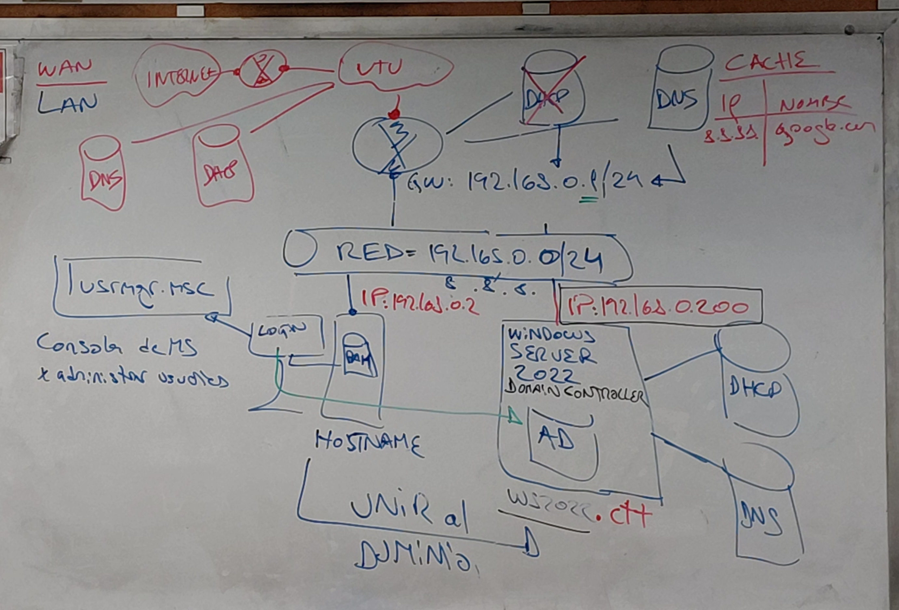
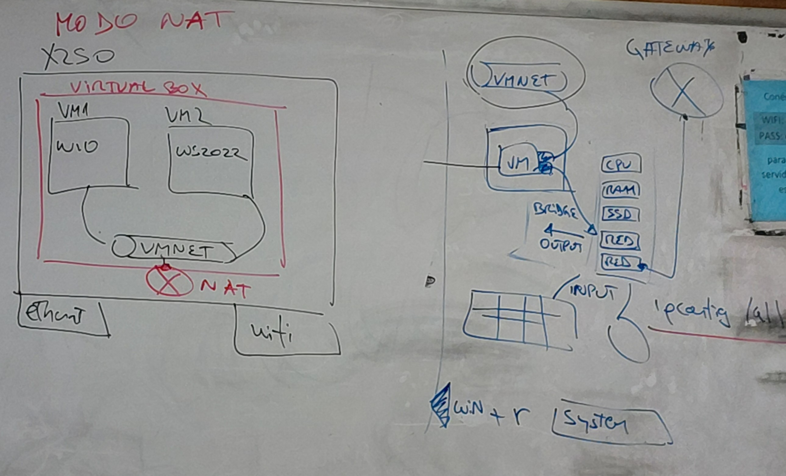
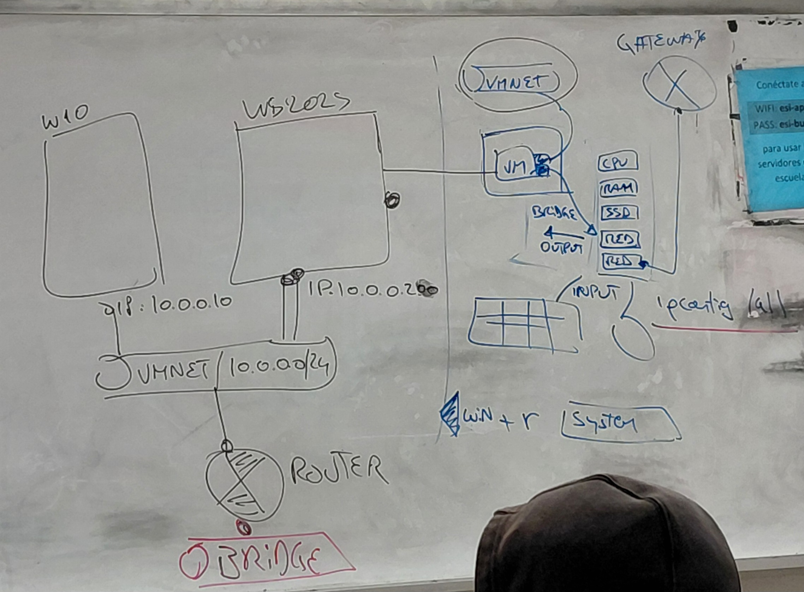
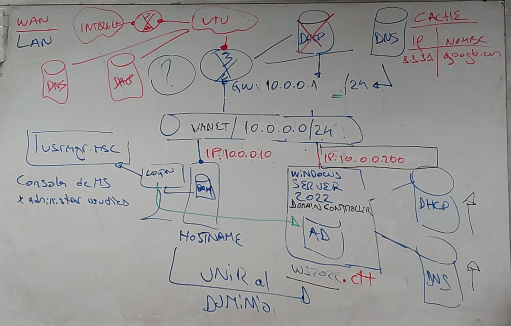

# Apuntes de Redes: Virtualización, Servicios de Red y Dominio CTT

## 1. Diseño y Evolución de la Red de Laboratorio

El profesor planteó cómo estructurar un entorno virtualizado para probar servidores sin afectar la red física real, simulando la relación entre una **WAN** (Internet/UTU) y una **LAN** (Laboratorio).

### Conceptos Fundamentales
* **VirtualBox:** Hipervisor para gestionar las Máquinas Virtuales (VMs).
* **Aislamiento:** La red interna (**VMNET**) debe estar aislada para evitar que nuestro servidor DHCP interfiera con el router real de la institución o del hogar.

### Escenario 1: Jerarquía Inicial (Red 192.168.0.0/24)
Se visualiza la conexión desde la nube de UTU hasta los servicios locales.

* **WAN:** Salida a Internet vía UTU.
* **Gateway (GW):** Localizado en `192.168.0.1/24`.
* **Servicios de Red:** Tachamos el **DHCP** en el router principal para indicar que el control de IPs lo tomará nuestro servidor.
* **Host de Gestión:** Una terminal con `IP: 192.168.0.2` conectada a la red.

*Diagrama del pizarrón: Relación WAN/LAN y ubicación de servidores DNS/DHCP.*

---

## 2. Configuración en VirtualBox y Modos de Adaptador

### Modos de Adaptador: NAT vs. Bridge
* **Modo NAT (Network Address Translation):** Direcciona el tráfico de la red interna (LAN) a la externa (WAN) usando la IP del host físico. Permite que las VMs tengan internet, pero el mundo exterior no puede iniciar conexiones hacia ellas.
* **Modo Bridge (Puente):** La VM se conecta directamente al router físico, obteniendo una IP del mismo rango que una PC real.
* **VMNET (Red Interna):** Segmento aislado donde conviven el servidor (WS2022) y el cliente (W10).

*Diagrama del pizarrón: Esquema de Modo NAT y componentes de una VM (CPU, RAM, SSD, RED).*

---

### 2.1 Configuración Lógica de la VM y Hardware Virtual

* **Componentes de la VM:** Asignación de recursos de **CPU, RAM y SSD**.
* **Doble Interfaz de Red:** * **Interfaz 1:** Conectada a la **VMNET** (interna aislada).
  * **Interfaz 2:** Conectada al exterior mediante **BRIDGE/NAT**.
* **IP Config:** Uso de `ipconfig /all` para verificar direccionamiento y DNS.
* **Gateway con X:** Simboliza que la salida a internet está mediada por nuestra infraestructura virtual y no por el Gateway físico directamente.

*Detalle de hardware virtual, interfaces de red y comando ipconfig /all.*

---

## 3. Servicios Core y Windows Server 2022

### Roles del Servidor
1. **Active Directory (AD):** Centraliza usuarios y equipos. Gestionado con `usrmgr.msc`.
2. **DNS (Domain Name System):** Traduce nombres a IPs.
   * **Caché:** Ejemplo: `google.com` -> `8.8.8.8`.
3. **DHCP:** Entrega IPs automáticamente en un **Ámbito**.
   * *Nota importante:* "En una red no pueden haber 2 DHCP activos".

### El Dominio CTT
El **FQDN** se configura con el sufijo `.ctt` (Curso Técnico Terciario).
* **Nombre del Dominio:** `WS2022.CTT` o `local.ctt`.
* **Unirse al Dominio:** Permite el inicio de sesión centralizado en cualquier PC.

### Escenario 2 y 3: Ruteo y Cambio de IP (Red 10.0.0.0/24)
* **Segmento Interno:** `10.0.0.0/24`.
* **Cliente W10:** `IP: 10.0.0.10`.
* **Servidor WS2022:** `IP: 10.0.0.200`.
* **Gateway de Salida:** `10.0.0.1/24`.

*Esquema de ruteo final y apuntes sobre servicios DNS/DHCP.*

---

## 4. Herramientas de Diagnóstico y Comandos (CMD)

| Comando | Descripción / Uso |
| :--- | :--- |
| `ipconfig /all` | Muestra IP, Máscara, GW y servidores DNS/DHCP. |
| `ipconfig /release` | Libera la IP actual del DHCP. |
| `ipconfig /renew` | Solicita una nueva IP al DHCP. |
| `ping [IP]` | Prueba conectividad básica. |
| `mstsc` | Abre Conexión a Escritorio Remoto (RDP). |
| `mstsc /v:[IP]` | Conecta a un servidor específico (Puerto 3389 / 3306). |
| `sysdm.cpl` | Propiedades del sistema (Nombre de equipo/Dominio). |
| `winver` | Muestra la versión de Windows. |
| `usrmgr.msc` | Administrador de usuarios y grupos. |

### Atajos y Notas Técnicas
* **Host Key (Ctrl Derecho) + Supr:** Comando de inicio de sesión en VM.
* **Archivos .OVA:** Formato para importar máquinas virtuales.
* **Orden de Encendido:** 1° DHCP -> 2° DNS.